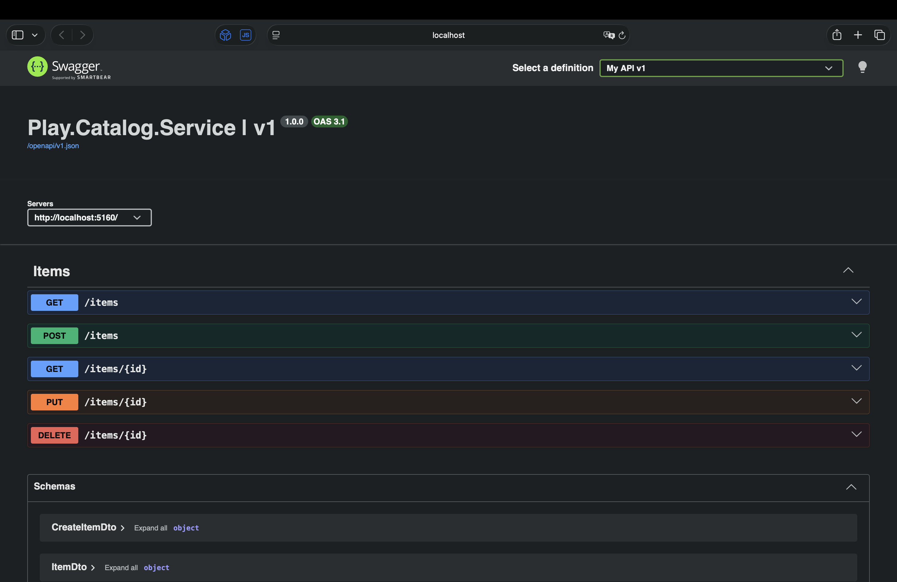
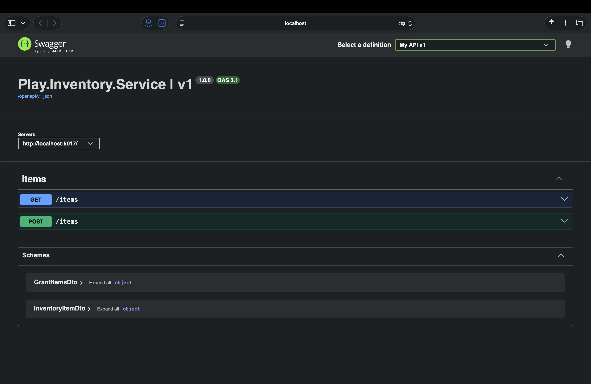
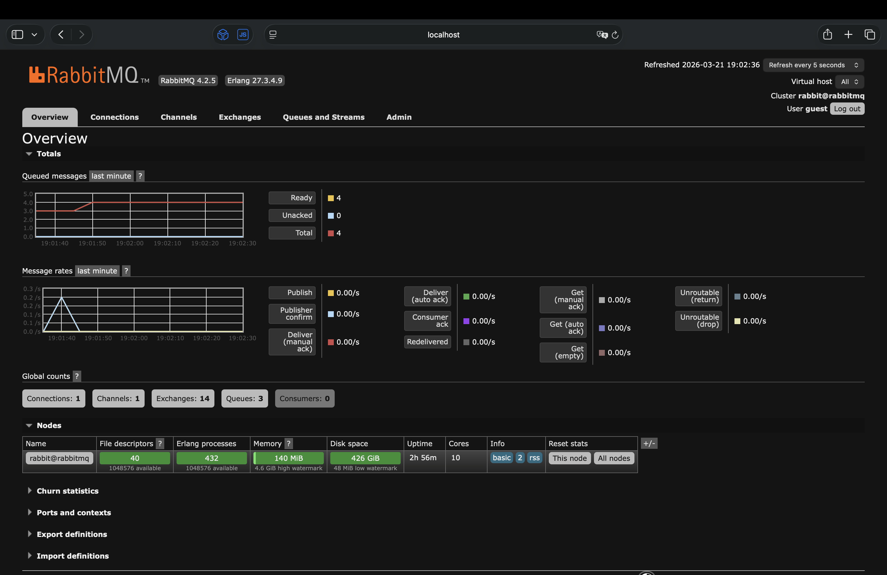
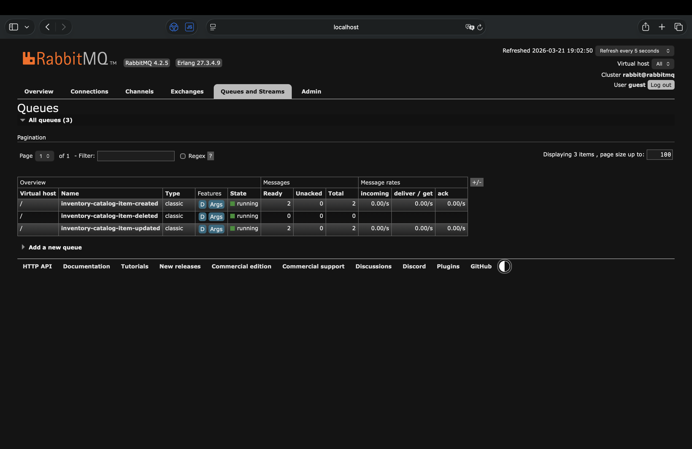

# Store

A store backend implemented in .NET with a microservices architecture. Uses Docker and RabbitMQ messaging broker.

### Features
 - Microservices architecture
 - MongoDB
 - Docker
 - RabbitMQ

### Prerequisites
Download and install [.NET](https://dotnet.microsoft.com/en-us/download) runtime and [Docker Desktop](https://www.docker.com/products/docker-desktop/) containerization software.

## Setup

1. Create directory _/packages_ in the project root directory, then register it as a local NuGet package source: 
```console
dotnet nuget add source ./packages --name "Play.Packages"
```

2. Pack the following class libraries into NuGet packages:

Play.Common
```console 
dotnet pack -p:PackageVersion=1.0.2 -o ../packages
```
Play.Catalog.Contracts
```console 
dotnet pack -o ../packages
```

3. Install dependencies for each microservice using ```dotnet restore```.

## Run

1. Start local environment in directory _Play.Infra_ with Docker:
```console
docker compose up -d
```
Docker will setup volumes for MongoDB data and RabbitMQ data.

2. Navigate to Play.Catalog.Service and Play.Inventory.Service and run them with:
```console
dotnet run
```

## RabbitMQ
RabbitMQ is a message broker that enables applications, services, and systems to communicate asynchronously by sending, receiving, queuing, and routing messages.
- When a consumer microservice is temporarily down and comes back online, it will automatically start receiving and processing the messages that accumulated in its queue during the downtime.
- When a publisher microservice is temporarily down, the consumer microservice has kept a small materialized view of the data that the down microservice owns and has previously shared via events, so the consumer microservice can keep operating.


## Presentation

| Catalog Service Swagger                    | Inventory Service Swagger                      | 
|--------------------------------------------|------------------------------------------------|
|  |  |

| RabbitMQ Overview                              | RabbitMQ Queues                            | 
|------------------------------------------------|--------------------------------------------|
|  |  |
